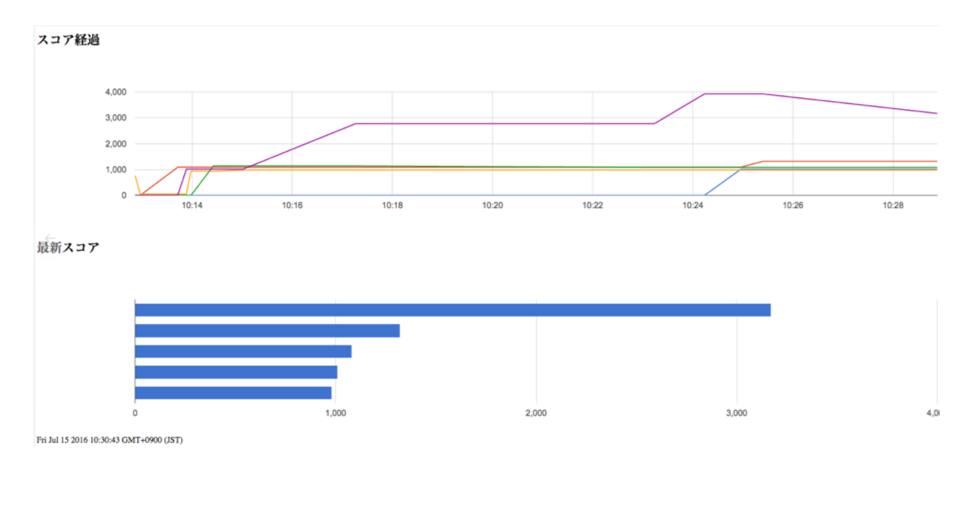

# PTC 結果描画用ポータルページ

## 本リポジトリでできること

Firebaseをデータストアとして利用して、保存したデータを描画するためのポータルページです。
以下のようなグラフをリアルタイムで描画します。



## 使い方

本リポジトリを `git clone` したのち、 `npm install` で関連モジュールをインストールしてください。
その後、 `src/app.js` にある以下の行をご自身のFirebaseアカウントに変更してください。

```
const baseUrl = 'https://XXXX.firebaseio.com/'; 
```

変更が完了したら、 `webpack` コマンドにて、ビルドすれば `dist` 配下に成果物が出力されます。
dist配下に出力された、html/js を任意のWebサーバにデプロイいただければそのままご利用いただけます。

## Build Utility

Dockerをつかってビルドする

```
make build
```

ポータルに配置する

```
make place
```

## 備考

### データスキーマ

Firebaseは、以下のJSON形式でデータが保存されていることを前提としています。
JSONのPOST先URLは、 `https://XXXX.firebaseio.com/teams/:チーム名.json` になります。

```
{  
  "pass":true,
  "score":18000,
  "level": 10,
  "results": {
    "successCount": 1434,
    "failureCount":0,
  },
  "timestamp": $unixInMilliseconds
}
```

ベンチマーカが走りきった後に、上記JSONをFirebaseへHTTP Postで渡すようにしてください。

### Firebaseの設定

Firebase側の`.read`は認証が無い前提で利用しています。

もし認証を追記される場合は、[公式ドキュメント](https://www.firebase.com/docs/web/guide/login/password.html) を参考に、
Firebase接続部分のコードの変更が必要です。

